# Praktikum Modul 1 20 September 2021
## Anggota Kelompok ##

Aji Wahyu Admaja Utama 05111940000073

Muhammad Haikal Aria Sakti 05111940000088

Ivan Muhammad Nizar 05111940000052

### 1. Sebutkan webserver yang digunakan pada "ichimarumaru.tech"!
**Display Filter:**
```http.host=="ichimarumaru.tech" && http.request```
  
->lalu kemudian klik kanan pada paket yang didapat lalu dilakukan follow-> TCP stream
  
->kemudian mendapat informasi server
  
web server yang digunakan adalah nginx/1.18.0 (Ubuntu)

### 2. Temukan paket dari web-web yang menggunakan basic authentication method!
**Display Filter:**
```http.authbasic```


### 3. Ikuti perintah di basic.ichimarumaru.tech! Username dan password bisa didapatkan dari file .pcapng!  
Username dan password didapatkan menggunakan   
**Display Filter:**  
```http.host contains "basic.ichimarumaru.tech"```
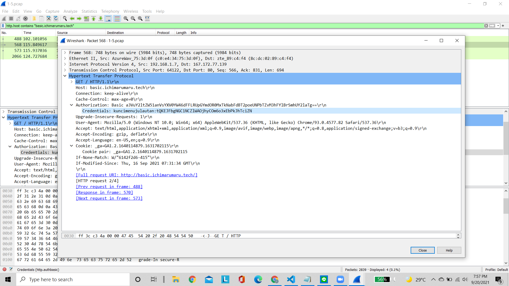  
Username: `kuncimenujulautan`  
password: `tQKEJFbgNGC1NCZlWAOjhyCOm6o3xEbPkJhTciZN`
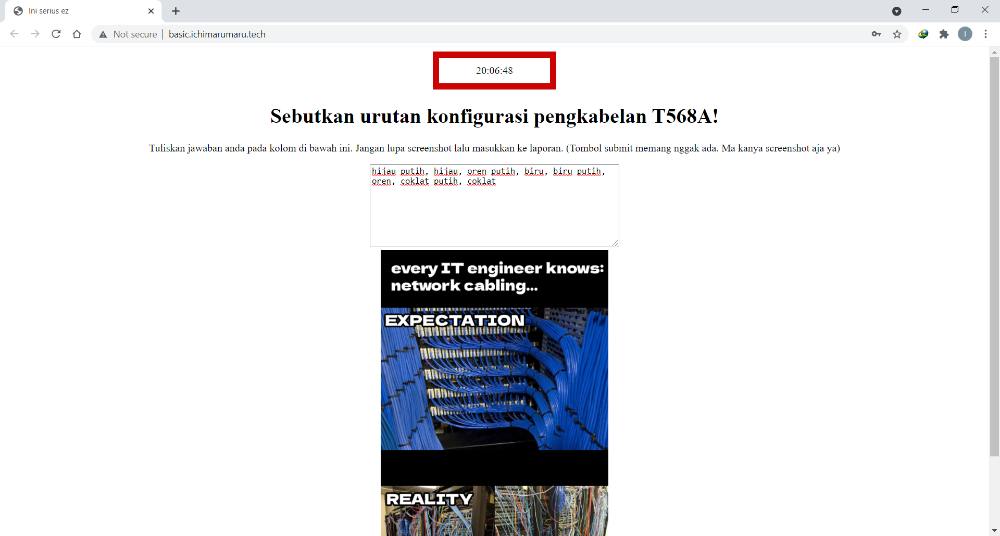  
### 4. Temukan paket mysql yang mengandung perintah query select!  
**Display filter:**  
`mysql.query matches select`  
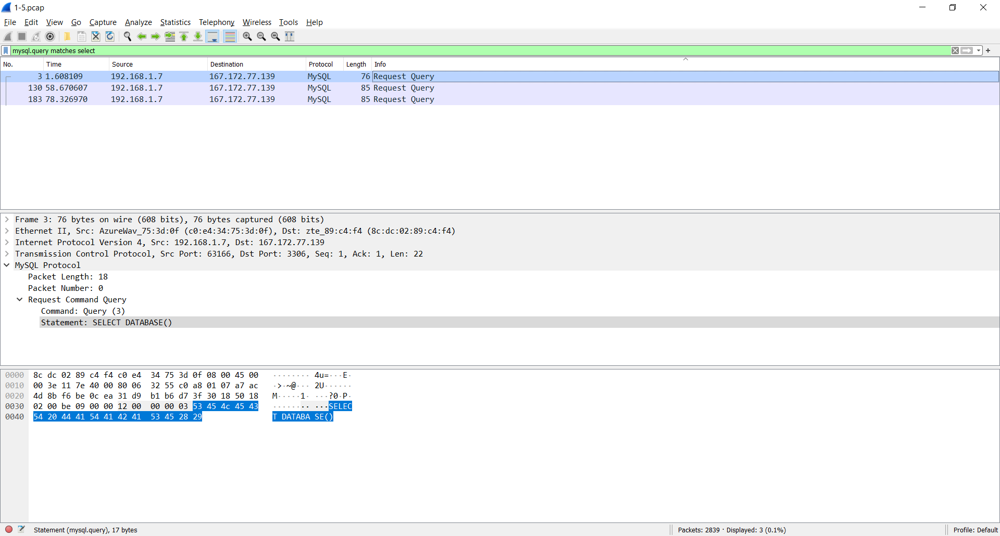

### 5. Login ke portal.ichimarumaru.tech kemudian ikuti perintahnya! Username dan password bisa didapat dari query insert pada table users dari file .pcap
**Display Filter:**
```mysql``` 
->lalu kemudian klik kanan pada paket yang didapat lalu dilakukan follow-> TCP stream

->kemudian mendapat informasi username dan password
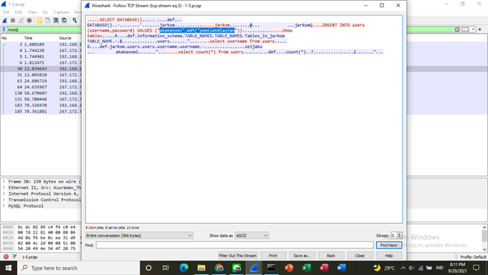

->Username: `akakanomi`

->Password: `pemisah4lautan`

->Login ke portal.ichimarumaru.tech kemudian mengikuti perintahnya
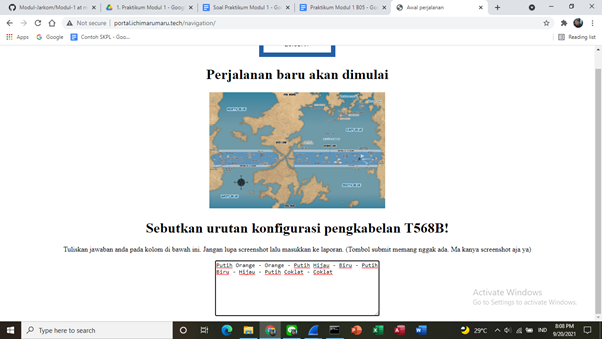

### 6. Cari username dan password ketika melakukan login ke FTP Server!
**Display Filter:**
```ftp.request.command == "USER"```
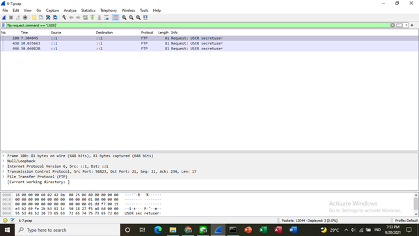

**Display Filter:**
```ftp.request.command == "PASS"```
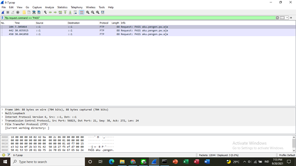

->Username: `secretuser`

->Password: `aku.pengen.pw.aja`

### 7. Ada 500 file zip yang disimpan ke FTP Server dengan nama 0.zip, 1.zip, 2.zip, ..., 499.zip. Simpan dan Buka file pdf tersebut. (Hint = nama pdf-nya "Real.pdf")
**Display Filter:**
```ftp-data contains "Real.pdf"```
 

-> lalu dapat dipilih salah satu paket kemudian di klik kanan pada paket tersebut kemudian follow-> TCP Stream
 

-> setelah itu pada bagian show data as dibuat ke RAW lalu di Save as dengan nama file misal Jarkom dengan format zip jadi "Jarkom.zip"
 

-> setelah itu membuka file hasil download tersebut


-> kemudian saat dibuka filenya akan menampilkan halaman berikut
 

### 8. Cari paket yang menunjukan pengambilan file dari FTP tersebut!
**Display Filter:**
```ftp.request.command == RETR```
 

### 9. Dari paket-paket yang menuju FTP terdapat indikasi penyimpanan beberapa file. Salah satunya adalah sebuah file berisi data rahasia dengan nama "secret.zip". Simpan dan buka file tersebut!
**Display Filter:**
```ftp-data.command contains "secret.zip"```
 

-> lalu dapat dipilih salah satu paket kemudian di klik kanan pada paket tersebut kemudian follow-> TCP Stream
 

-> setelah itu pada bagian show data as dibuat ke RAW lalu di Save as dengan nama file "secret.zip"
 

-> Ketika dibuka file zip masih ada password yang diperlukan untuk membuka pdf
 

### 10. Selain itu terdapat "history.txt" yang kemungkinan berisi history bash server tersebut! Gunakan isi dari "history.txt" untuk menemukan password untuk membuka file rahasia yang ada di "secret.zip"!
**Display Filter:**
```ftp-data.command contains "history.txt"```
 

-> lalu dapat dipilih salah satu paket kemudian di klik kanan pada paket tersebut kemudian follow-> TCP Stream
 

-> Pada bagian line-based terdapat tulisan seperti key= “bukanapaapa.txt” 
 

-> lalu **Display Filter:** 
```ftp-data.command contains "bukanapaapa.txt"```
 

-> lalu dapat dipilih salah satu paket kemudian di klik kanan pada paket tersebut kemudian follow-> TCP Stream
 

-> Pada bagian line-based terdapat tulisan d1b1langbukanapaapajugagapercaya yang merupakan passwordnya
 

-> lalu saat dimasukkan passwordnya ke file Wanted.pdf
 

### 11. Filter sehingga wireshark hanya mengambil paket yang berasal dari port 80!  
**Capture Filter:**  
`src port 80`  
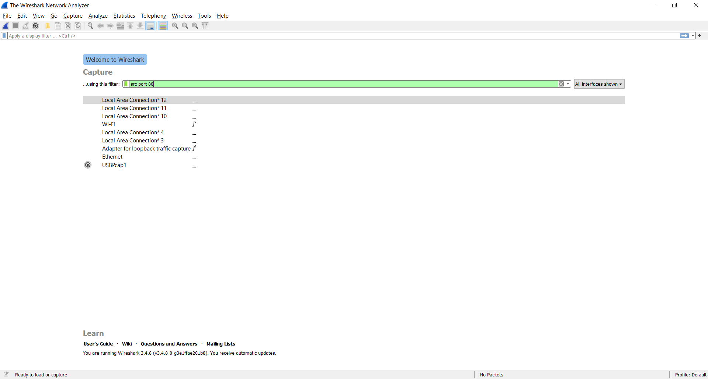  
**Hasil:**  
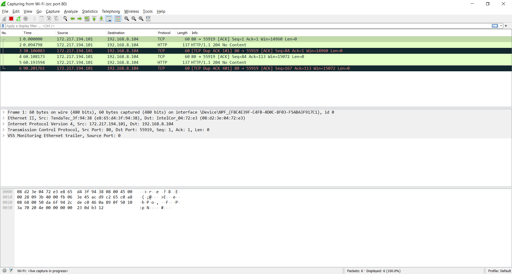  

### 12. Filter sehingga wireshark hanya mengambil paket yang mengandung port 21! 
**Capture Filter:** 
```port 21```
 

->Buka cmd dan ```telnet my.its.ac.id 21```

**Hasil** 

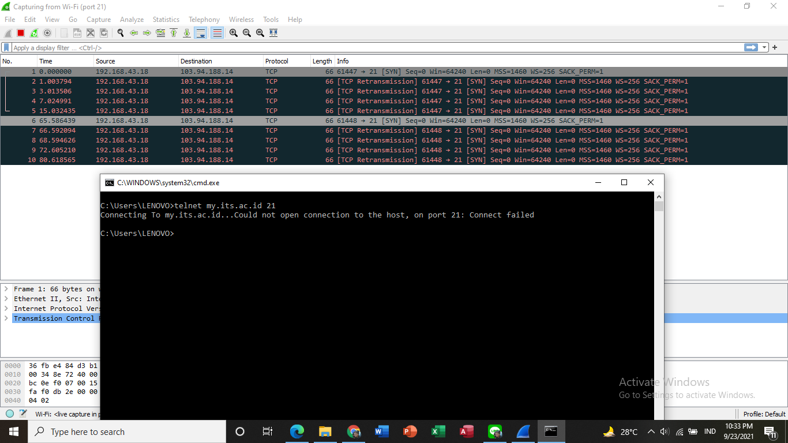 

### 13. Filter sehingga wireshark hanya mengambil paket yang menuju port 443!  
**Capture Filter:**  
`dst port 443`  
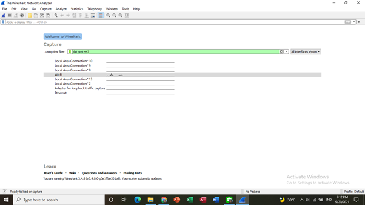  
**Hasil:**  
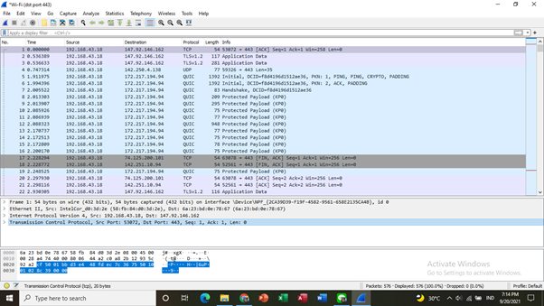 

### 14. Filter sehingga wireshark hanya mengambil paket yang tujuannya ke kemenag.go.id!
->Buka cmd dan ```ping kemenag.go.id```
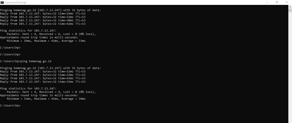 

**Capture Filter:**  
```dst host 103.7.13.247```
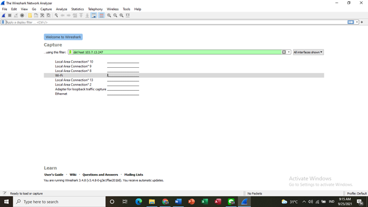  
**Hasil:**  
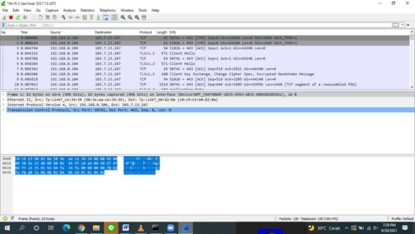 
